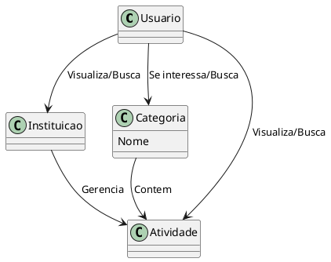

```plantuml
@startuml

class Usuario {
}

class Instituicao {
   
}

class Categoria {
    Nome
}

class Atividade {
    
}

' Relacionamentos
Instituicao --> Atividade : Gerencia
Categoria --> Atividade : Contem
Categoria -[hidden]down- Atividade
Usuario --> Categoria : Se interessa/Busca
Usuario --> Atividade : Visualiza/Busca
Usuario --> Instituicao : Visualiza/Busca


@enduml
```
